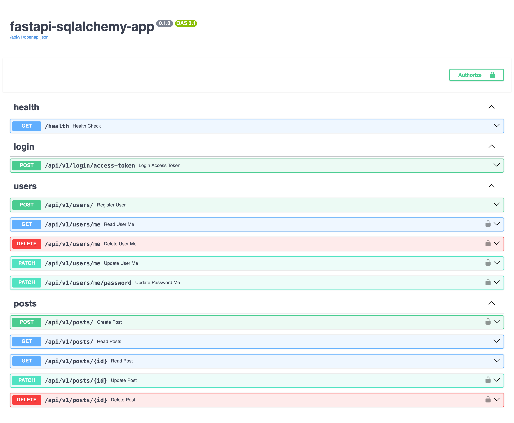
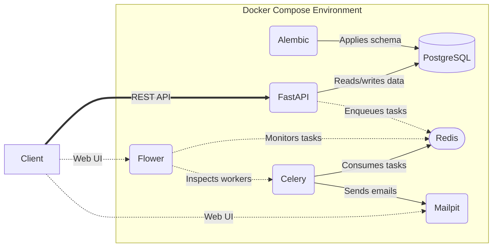

# Reference Implementation of an Asynchronous FastAPI & SQLAlchemy 2.0 Application


A comprehensive example of a scalable backend application built with FastAPI, SQLAlchemy 2.0, PostgreSQL, Celery, and Docker.

Instead of being tied to a specific business niche, this project provides a foundational social platform codebase designed to showcase enterprise-grade engineering patterns, robust security practices, and a modern containerized workflow.

This repository is heavily optimized for a seamless local development experience while maintaining production standards.

## API Preview



## Tech Stack

| Category                | Technology                                        |
|:------------------------|:--------------------------------------------------|
| **Framework**           | FastAPI                                           |
| **Data Validation**     | Pydantic V2                                       |
| **Database & ORM**      | PostgreSQL, asyncpg, SQLAlchemy 2.0, Alembic      |
| **Security**            | PyJWT, pwdlib                                     |
| **Background Tasks**    | Celery, Redis, Flower, Mailpit                    |
| **Environment**         | Docker, uv, Pydantic Settings                     |
| **Development Tooling** | pytest, mypy, Ruff, hadolint-py, pre-commit, just |

## Key Features

- **Non-blocking execution:** An end-to-end asynchronous codebase engineered to maximize concurrency and throughput across the entire application lifecycle, from API routing and database I/O to running tests and utility scripts.
- **Modern API:** A high-performance REST interface built with FastAPI and validated by Pydantic V2.
- **Robust database layer:** PostgreSQL accessed via asyncpg and integrated with SQLAlchemy 2.0 for efficient ORM operations and Alembic (featuring post-write hooks) for reliable schema versioning.
- **Security by design:** Standard-compliant JWT-based authentication set up with PyJWT, paired with Argon2 password hashing via pwdlib with automatic hash upgrading. The project also uses dummy hash verification during login to mitigate timing attacks, `extra="forbid"` protection against mass assignment vulnerabilities, and Pydantic's `SecretStr` to prevent accidental credential leakage in logs or tracebacks.
- **Resilient background processing:** Celery integrated with a Redis broker and monitored via Flower with persistent task history, showcasing a fault-tolerant `send_welcome_email` dispatcher. The implementation features exponential backoff, strict time limits, and automatic retries for SMTP or OS-level exceptions to ensure delivery.
- **Rigorous testing:** A production-grade test suite driven by pytest and httpx, including full integration tests utilizing parametrization and Pydantic schemas against a dedicated PostgreSQL database. The suite guarantees test isolation via SQLAlchemy savepoint rollbacks and employs targeted mocking to intercept Celery tasks and simulate infrastructure outages.
- **Advanced application configuration:** A centralized setup using Pydantic Settings with programmatic, type-safe DSN construction (`PostgresDsn`, `RedisDsn`) and post-initialization data validation.
- **Unified logging system:** A consolidated logging architecture designed for deep traceability. It aligns logs of core application components into a single cohesive stream, adapts formatters based on the environment, and captures critical business events for thorough system visibility.
- **Deterministic dependency management:** A streamlined toolchain powered by uv for rapid package resolution, reproducible builds via `uv.lock`, and seamless virtual environment handling across the entire development lifecycle.
- **Optimized containerization:** A multi-stage `Dockerfile` engineered for security, speed, and minimal image size. It ensures a hardened execution environment by operating as a non-root user, leverages uv's efficient caching with hardlink-free virtual environment copying, and pre-compiles bytecode to accelerate startup. Additionally, it utilizes a slim base image, excludes build dependencies from the final artifact, and prevents runtime bytecode generation.
- **Frictionless local infrastructure:** A sophisticated `compose.yaml` that reliably orchestrates the services with precise healthcheck-based startup sequencing, automatic schema migrations on boot, and bind mounts to enable hot-reloading.
- **Exhaustive static analysis:** A code quality toolchain including mypy in strict mode and Ruff leveraging nearly 40 rule categories to guarantee type safety, exceptional code quality, and idiomatic Python practices.
- **Extensive pre-commit configuration:** Git hooks that lint and format Python code, validate `Dockerfiles` via hadolint-py, and enforce conventional commit messages.
- **Developer workflow automation:** A versatile `justfile` that abstracts Docker Compose commands into clean shortcuts for container orchestration, interactive debugging, database migrations, testing, linting, and formatting. This is supplemented by a dedicated seeding script to instantly populate the database with sample users and posts.
- **Meticulous documentation:** 100% docstring coverage adhering to Google style across all modules, functions, classes, and methods, supplemented by strategic comments. These docstrings seamlessly translate into endpoint details within the project's comprehensive OpenAPI documentation. The latter further features fully annotated request and response schemas with built-in examples, as well as custom error responses with descriptions.

## System Architecture



## Project Structure

This repository follows a layered, decoupled architecture designed for high maintainability:

```text
├── alembic/  # Database migration setup
│   ├── versions/  # Migration scripts
│   ├── env.py
│   └── script.py.mako
├── app/  # Main package
│   ├── api/  # API endpoints and dependencies
│   │   ├── v1/  # Version 1 API endpoints
│   │   │   ├── __init__.py
│   │   │   ├── login.py
│   │   │   ├── posts.py
│   │   │   └── users.py
│   │   ├── __init__.py
│   │   ├── deps.py
│   │   ├── health.py
│   │   └── main.py
│   ├── celery/  # Celery application setup and tasks
│   │   ├── __init__.py
│   │   ├── celery_app.py
│   │   └── tasks.py
│   ├── core/  # Core modules
│   │   ├── __init__.py
│   │   ├── config.py
│   │   ├── db.py
│   │   ├── logger.py
│   │   └── security.py
│   ├── crud/  # Data access layer
│   │   ├── __init__.py
│   │   ├── post.py
│   │   └── user.py
│   ├── models/  # SQLAlchemy ORM models
│   │   ├── __init__.py
│   │   ├── post.py
│   │   └── user.py
│   ├── schemas/  # Pydantic schemas for API input/output
│   │   ├── __init__.py
│   │   ├── error.py
│   │   ├── post.py
│   │   ├── token.py
│   │   └── user.py
│   ├── __init__.py
│   └── main.py
├── assets/  # Documentation assets
│   └── api-preview.png
├── scripts/  # Utility scripts
│   ├── __init__.py
│   └── seed_db.py
├── tests/  # Test suite
│   ├── __init__.py
│   ├── conftest.py
│   ├── constants.py
│   ├── init-test-db.sql
│   ├── test_deps.py
│   ├── test_health.py
│   ├── test_login.py
│   ├── test_posts.py
│   └── test_users.py
├── .commitlintrc.yaml
├── .dockerignore
├── .env.example
├── .gitignore
├── .pre-commit-config.yaml
├── .python-version
├── compose.yaml
├── Dockerfile
├── justfile
├── LICENSE
├── pyproject.toml
├── README.md
└── uv.lock
```

## Getting Started

### Prerequisites
Before you begin, ensure you have the following installed:
- [Git](https://git-scm.com/install/)
- [Docker Desktop](https://docker.com/products/docker-desktop/) (or a drop-in replacement like [OrbStack](https://orbstack.dev/download))
- [just](https://just.systems/man/en/installation.html) (command runner)

### Setup

**1. Clone the repository and configure the environment variables**

```bash
git clone https://github.com/tdgibadullin/fastapi-sqlalchemy-app
cd fastapi-sqlalchemy-app
# Create the .env file with pre-configured values suitable for local development.
cp .env.example .env
```

**2. Spin up the infrastructure**

Verify that Docker Desktop or a compatible alternative is running. Then, start the entire stack (PostgreSQL, Redis, Mailpit, Alembic, FastAPI, Celery, and Flower services) in detached mode:

```bash
just up
```

*Note:* The initial startup may take a few minutes as Docker downloads and builds the images.

**3. Seed the database (optional but recommended)**

Populate the database with sample users and posts to facilitate local development:

```bash
just seed
```

**4. Tear down the stack**

When you are finished, stop and remove containers and networks:

```bash
just down
```

## API Documentation & Monitoring

Once the application is running, you can access the following services:

- **Swagger UI:** <http://localhost:8000/docs> \
*Note:* To test protected endpoints, click the **Authorize** button and enter one of the credential sets seeded in step 3 of [Setup](#setup) (for example, `user1@example.com` / `password123`). Under **Client credentials location**, choose `Authorization header` and leave the **client_id** and **client_secret** fields empty.
- **Redoc:** <http://localhost:8000/redoc>
- **Mailpit:** <http://localhost:8025> *(intercept and view outgoing emails locally)*
- **Flower:** <http://localhost:5555> *(monitor Celery tasks and workers)*

## `just` Commands

This project uses `just` to encapsulate complex Docker Compose operations into simple shortcuts. Available commands:

- `just` — show all available commands
- `just build` — build or rebuild services
- `just up` — create containers and start them in the background
- `just down` — stop and remove containers (including orphan containers) and networks
- `just clean` — stop and remove containers (including orphan containers), networks, and volumes
- `just logs [service]` — follow logs for a service (e.g., `just logs worker`); if not specified, the service name defaults to `api`
- `just bash` — open an interactive Bash shell inside the `api` container
- `just psql` — open an interactive PostgreSQL shell (psql)
- `just format` — auto-fix linting errors and format code (Ruff)
- `just lint` — run strict linting and type checking (Ruff + mypy)
- `just test [args...]` — run pytest (e.g., `just test -k test_users`)
- `just revision <message>` — generate a new Alembic migration (e.g., `just revision "create comments table"`)
- `just migrate` — apply all pending Alembic migrations
- `just downgrade` — revert the last applied Alembic migration
- `just seed` — seed the database with initial dummy data

## License

This project is available under the MIT License. See the [LICENSE](LICENSE) file for details.

## Author

© [Timur Gibadullin](https://github.com/tdgibadullin) ([tdgibadullin@gmail.com](mailto:tdgibadullin@gmail.com)), 2026
